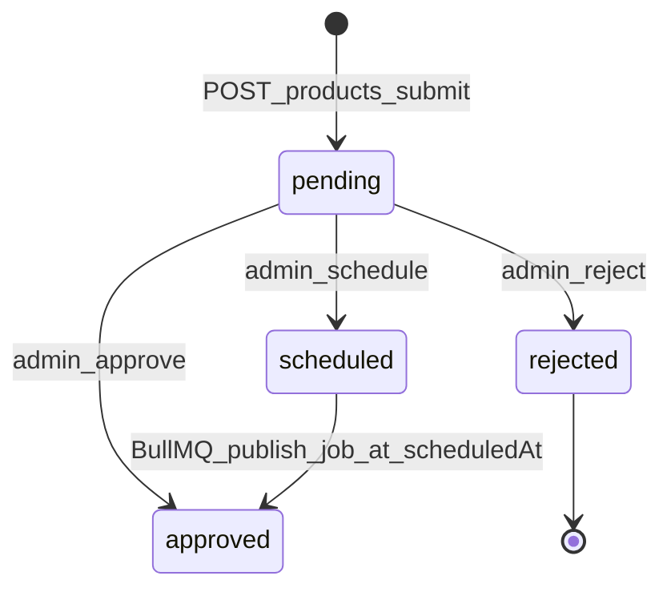
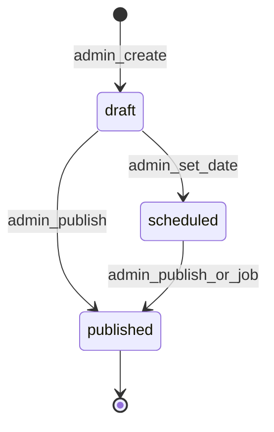

# Stackd Backend — Master Plan

Dokumen ini adalah **sumber kebenaran tunggal** untuk implementasi backend Stackd. Baca sebelum menulis kode.

**Repo terkait:**
- Backend (repo ini): `stackd-backend` → `https://github.com/alprince76/stackd-backend`
- Frontend (Lovable, **jangan diubah fase 1**): `stack-id-product` → mock data di `src/lib/mock-data.ts`

**Dokumen pendukung:**

| File | Isi |
|------|-----|
| [PROMPT.md](./PROMPT.md) | Prompt siap-tempel untuk Cursor Agent |
| [docs/FLOWS.md](./docs/FLOWS.md) | Alur per fitur + mapping frontend → backend |
| [docs/API-CONTRACT.md](./docs/API-CONTRACT.md) | Kontrak response, error codes, contoh JSON |
| [docs/SEED.md](./docs/SEED.md) | Spesifikasi seed mirror mock-data.ts |

---

## 1. Tujuan & Scope

Bangun REST API `/api/v1` untuk platform product launch Stackd (Product Hunt versi Indonesia).

**Fase 1 (repo ini):** Backend standalone — NestJS, Postgres, Redis, MinIO. Frontend tetap mock.

**Fase 2 (repo frontend, nanti):** Ganti `mock-data.ts` + `app-store.tsx` dengan HTTP calls. Lihat [Boundary Matrix](#4-boundary-matrix) agar tidak bentrok.

---

## 2. Stack Teknis

| Layer | Pilihan |
|-------|---------|
| Runtime | Node.js 20 LTS |
| Framework | NestJS 10, TypeScript strict |
| Database | PostgreSQL 16 + Prisma ORM |
| Cache/Queue | Redis 7 — rate limit, BullMQ, refresh blacklist |
| Storage | S3-compatible (dev: MinIO) via presigned URL |
| Auth | JWT RS256 access (15m) + refresh rotating httpOnly cookie (7d), Argon2id |
| Email | Resend via `EmailProvider` interface |
| Test | Jest + Supertest + Testcontainers |
| Observability | pino, Sentry, OpenAPI `/api/docs` |
| Deploy | Docker; prod: Fly.io / Railway / ECS |

---

## 3. Struktur Folder

```
stackd-backend/
├── src/
│   ├── main.ts
│   ├── app.module.ts
│   ├── common/            # guards, interceptors, filters, pipes, decorators
│   │   ├── guards/        # jwt, roles, throttle
│   │   ├── decorators/    # @CurrentUser(), @Roles(), @Public()
│   │   ├── filters/       # http-exception, prisma-exception
│   │   └── dto/           # pagination, id-param
│   ├── config/            # env schema (zod), typed config
│   ├── prisma/            # PrismaService + module
│   ├── modules/
│   │   ├── auth/
│   │   ├── users/
│   │   ├── products/
│   │   ├── votes/
│   │   ├── comments/
│   │   ├── categories/
│   │   ├── newsletters/
│   │   ├── admin/
│   │   ├── uploads/
│   │   ├── search/
│   │   └── health/
│   └── jobs/              # BullMQ: publish-product, send-newsletter
├── prisma/
│   ├── schema.prisma
│   ├── migrations/
│   └── seed.ts
├── test/
│   ├── unit/
│   └── e2e/
├── docs/
├── docker-compose.yml
├── Dockerfile
├── .env.example
├── PLAN.md
├── PROMPT.md
└── README.md
```

---

## 4. Boundary Matrix

Mencegah tumpang tindih antara frontend mock (fase 1) dan backend.

| Fitur | Owner Fase 1 | Owner Fase 2 | Jangan lakukan |
|-------|--------------|--------------|----------------|
| User login | Frontend: mock `signIn()` hardcode rifqi | Backend: `POST /auth/login` JWT | Jangan implement OAuth di backend fase 1 |
| Admin login | Frontend: cookie `stackd-admin` + `ADMIN_PASSWORD` | Backend: JWT + role `admin` | **Jangan** hapus admin session frontend sampai integrasi |
| Admin queue | Frontend: `app-store` pending/approve/reject/schedule | Backend: `/admin/products/*` | Jangan duplikasi queue logic di frontend saat integrasi |
| Product submit | Frontend: local `done` state (tidak masuk queue) | Backend: `POST /products` → `pending` | Backend **tidak** baca form of submit form |
| Leaderboard | Frontend: filter `launchDate` on static `PRODUCTS` | Backend: `GET /products?tab=today\|...` | Jangan pakai 2 definisi "visible" berbeda |
| Upvote | Frontend: `Set` + `votes` in-memory | Backend: tabel `Vote`, toggle idempotent | Jangan denormalize count tanpa sync |
| Comments | Frontend: `commentsByProduct` in-memory | Backend: tabel `Comment` + count query | Jangan simpan `comments` count di Product row |
| Newsletter CMS | Frontend: `INITIAL_NEWSLETTERS` in-memory | Backend: `/admin/newsletters` CRUD | Public list dari backend `status=published` |
| Subscribe | Frontend: toast only | Backend: double opt-in email | — |
| File upload | Frontend: UI placeholder | Backend: presigned PUT URL only | Server **tidak** proxy upload body |
| Search | Frontend: client filter `PRODUCTS` | Backend: pg_trgm | Jangan pasang Elasticsearch MVP |

### Dual Auth (sengaja, sementara)

```
Frontend admin  →  cookie stackd-admin  →  TanStack Start server fn
Backend admin   →  JWT + UserRole.admin  →  /api/v1/admin/*
```

Keduanya **independen** sampai fase integrasi. Test admin backend pakai JWT, bukan cookie frontend.

---

## 5. State Machine — Product

Backend punya **satu** state machine. Frontend punya status string yang sedikit berbeda — gunakan mapping di bawah.



### Enum Prisma

```prisma
enum ProductStatus {
  pending
  scheduled
  approved
  rejected
}
```

### Field tambahan

| Field | Fungsi |
|-------|--------|
| `launchDate` | Tanggal launch (YYYY-MM-DD), dari form submit |
| `scheduledAt` | ISO datetime — kapan job publish dijalankan |
| `publishedAt` | ISO datetime — kapan produk **visible** di leaderboard |

### Aturan visibility leaderboard

Produk muncul di `GET /products?tab=...` **hanya jika**:

```
status = approved AND publishedAt IS NOT NULL
```

### Mapping frontend ↔ backend

| Frontend status | Backend | Kondisi |
|-----------------|---------|---------|
| `pending` | `pending` | Belum direview |
| `scheduled` | `scheduled` | Menunggu `scheduledAt` |
| `approved` | `approved` | Admin approve instant — set `publishedAt = now()` |
| `published` (UI badge) | `approved` | `publishedAt != null` — **bukan enum terpisah** |
| `rejected` | `rejected` | — |

### Admin approve = instant live

Frontend `approve()` langsung menampilkan produk di home. Backend **harus** set `publishedAt = now()` saat approve (bukan menunggu job), kecuali admin memilih schedule.

### Admin schedule

1. Set `status = scheduled`, `scheduledAt = <ISO>`
2. BullMQ job `publish-product` di `scheduledAt`:
   - Set `publishedAt = now()`
   - Tetap `status = approved`
   - Idempotent (cek sudah published)

---

## 6. State Machine — Newsletter



Enum Prisma: `draft | scheduled | published`

Public `GET /newsletters` hanya return `status = published`.

---

## 7. Model Data (Prisma)

### User

```
id, email (unique), passwordHash, username (unique), name,
avatarKey, bio, twitter, website, emailVerifiedAt, createdAt
```

Role via tabel terpisah — **JANGAN** kolom `users.role`:

```prisma
model UserRole {
  userId String
  role   Role   // user | maker | admin
  @@id([userId, role])
}
```

Helper wajib: `hasRole(userId: string, role: Role): Promise<boolean>`

Role assignment:
- Register → `user`
- First `POST /products` → tambah `maker`
- Seed admin → `admin` (+ `user`)

### Product

```
id, slug (unique), name, tagline, description,
thumbnailKey, screenshotKeys[], categoryId, tags[],
launchDate, website, makerId,
status, scheduledAt, publishedAt, createdAt
```

### Vote

PK gabungan `(userId, productId)` — satu upvote per user, toggle idempotent.

### Comment

```
id, productId, authorId, text, createdAt, deletedAt (soft delete)
```

### Follow

PK gabungan `(followerId, followingId)`.

### Category

```
slug (PK), name, emoji — seeded, read-only API
```

### Newsletter

```
id, title, slug, coverKey, shortDescription, content,
publishDate, status, featuredProductIds[]
```

### NewsletterSubscriber

```
email (unique), confirmedAt, unsubscribeToken
```

### RefreshToken

```
id, userId, tokenHash, expiresAt, revokedAt, userAgent, ip
```

### AdminAudit

```
id, adminId, action, targetType, targetId, metadata, createdAt
```

### Index penting

- `Product(status, launchDate DESC)`
- GIN pada `Product.tags`
- pg_trgm pada `Product.name`, `Product.tagline`
- `Vote(productId)`

---

## 8. Endpoint Coverage

Semua di `/api/v1`. 🔒 = JWT required. 👑 = role admin.

### Auth

| Method | Path | Auth |
|--------|------|------|
| POST | `/auth/register` | Public |
| POST | `/auth/login` | Public |
| POST | `/auth/refresh` | Cookie |
| POST | `/auth/logout` | 🔒 |
| POST | `/auth/verify-email` | Public |
| POST | `/auth/forgot-password` | Public |
| POST | `/auth/reset-password` | Public |
| GET | `/auth/me` | 🔒 |

### Users

| Method | Path | Auth |
|--------|------|------|
| GET | `/users/:username` | Public |
| PATCH | `/users/me` | 🔒 |
| POST | `/users/me/avatar-upload-url` | 🔒 |
| POST | `/users/:username/follow` | 🔒 toggle |
| GET | `/users/me/following` | 🔒 |

### Products

| Method | Path | Auth |
|--------|------|------|
| GET | `/products?tab=&category=&sort=&cursor=` | Public |
| GET | `/products/:slug` | Public |
| POST | `/products` | 🔒 → pending |
| PATCH | `/products/:id` | 🔒 owner / 👑 |
| DELETE | `/products/:id` | 🔒 owner / 👑 |
| POST | `/products/upload-url` | 🔒 presigned |

### Votes

| Method | Path | Auth |
|--------|------|------|
| POST | `/products/:id/vote` | 🔒 toggle, 30/min/user |
| GET | `/products/:id/voters?cursor=` | Public |

### Comments

| Method | Path | Auth |
|--------|------|------|
| GET | `/products/:id/comments?cursor=` | Public |
| POST | `/products/:id/comments` | 🔒 |
| DELETE | `/comments/:id` | 🔒 author / 👑 |

### Categories

| Method | Path | Auth |
|--------|------|------|
| GET | `/categories` | Public |
| GET | `/categories/:slug/products` | Public |

### Search

| Method | Path | Auth |
|--------|------|------|
| GET | `/search?q=&type=product\|creator` | Public |

### Newsletters (public)

| Method | Path | Auth |
|--------|------|------|
| GET | `/newsletters` | Public |
| GET | `/newsletters/:slug` | Public |
| POST | `/newsletters/subscribe` | Public |
| GET | `/newsletters/confirm?token=` | Public |
| POST | `/newsletters/unsubscribe?token=` | Public |

### Admin 👑

| Method | Path |
|--------|------|
| GET | `/admin/dashboard` |
| GET | `/admin/queue?status=pending\|scheduled` |
| POST | `/admin/products/:id/approve` |
| POST | `/admin/products/:id/reject` |
| POST | `/admin/products/:id/schedule` |
| POST/PATCH/DELETE | `/admin/newsletters` |
| POST | `/admin/newsletters/:id/publish` |
| POST | `/admin/contact` |

### Health

| Method | Path |
|--------|------|
| GET | `/health/live` |
| GET | `/health/ready` |

---

## 9. Urutan Implementasi (TDD)

**Jangan lompat urutan.** Per modul: e2e RED → unit test → implement GREEN → refactor → commit.

```
1. setup        docker-compose, prisma init, env, health
2. auth         register, login, refresh, logout, verify, forgot/reset
3. users        profile, PATCH me, follow
4. uploads      presigned URL
5. products     submit, list, detail, CRUD
6. votes        toggle idempotent
7. comments     list, create, delete
8. categories   read-only + seed
9. search       pg_trgm
10. newsletters subscribe + public list
11. admin       queue, approve/reject/schedule, dashboard, newsletter CRUD
12. jobs        BullMQ publish-product
13. ci          GitHub Actions
```

---

## 10. Keamanan (wajib)

- Password: Argon2id (memory 64MB, timeCost 3)
- Access JWT: RS256, refresh hashed di DB, cookie `HttpOnly; Secure; SameSite=Lax`
- Refresh rotation + reuse detection → revoke chain
- Rate limits (Redis): login 5/min/IP, vote 30/min/user, submit 5/hour/user, comment 20/min/user
- RBAC: `UserRole` table + `hasRole()` — bukan kolom di users
- Input: class-validator + zod; reject body > 100KB
- HTML sanitize: DOMPurify pada `description`, newsletter `content`
- Upload: MIME whitelist (png/jpeg/webp), max 5MB avatar / 10MB screenshot
- CORS: whitelist frontend origin only; helmet, HSTS
- CSRF: double-submit token atau custom header untuk state-changing + cookie refresh
- AdminAudit: log approve/reject/publish
- Env: Zod validation saat boot

---

## 11. Response Envelope

Success:

```json
{ "data": { ... }, "meta": { "nextCursor": "..." } }
```

Error:

```json
{ "error": { "code": "AUTH_INVALID_CREDENTIALS", "message": "...", "details": {} } }
```

Detail lengkap: [docs/API-CONTRACT.md](./docs/API-CONTRACT.md)

---

## 12. Seed Strategy

**Mirror penuh** frontend `mock-data.ts`:

| Entity | Count |
|--------|-------|
| Categories | 9 |
| Users | 10 makers + 1 admin |
| Products approved | 30 (id `"1"`–`"30"`) |
| Products pending | 3 (id `"p1"`–`"p3"`) |
| Comments | 50 |
| Newsletters | 2 (n4 published, n5 draft) |
| Votes | Synthetic — match `upvotes` count per product |

Detail: [docs/SEED.md](./docs/SEED.md)

---

## 13. Leaderboard Tab Logic

Backend `GET /products?tab=` — **satu sumber kebenaran** (ganti frontend filter nanti):

| Tab param | Query logic |
|-----------|-------------|
| `today` | `launchDate = today (WIB)` AND visible |
| `yesterday` | `launchDate = yesterday (WIB)` AND visible |
| `week` | `launchDate >= 7 days ago` AND visible |
| `month` | `launchDate >= 30 days ago` AND visible |

Sort default: `upvotes DESC`. Optional: `sort=newest`.

Visible = `status=approved AND publishedAt IS NOT NULL`.

---

## 14. Fase Integrasi Frontend (nanti)

Repo `stack-id-product` — **jangan sentuh sampai backend e2e hijau**.

| File frontend | Perubahan |
|---------------|-----------|
| `src/lib/api-client.ts` | Baru — fetch wrapper + adapter |
| `src/lib/app-store.tsx` | React Query mutations, bukan in-memory |
| Route loaders | Async fetch backend |
| `src/routes/submit.tsx` | POST `/products` + presigned upload |
| `src/lib/admin-auth.functions.ts` | Migrasi ke JWT admin (fase terpisah) |

Env: `VITE_API_URL=http://localhost:3001/api/v1`

---

## 15. Known Gaps (decisions locked)

| Gap | Keputusan MVP |
|-----|---------------|
| Submit form field `video` | **Abaikan** — tidak ada di schema Product |
| OAuth (Google/X) di login modal | **Fase 2** — backend email/password saja |
| Profile upvoted tab hardcoded | **Fase 2** — endpoint `GET /users/:username/upvotes` |
| Follower counts fake di creators | Backend return `followerCount` di user response |
| `NEWSLETTER_ISSUES` dead code frontend | Abaikan — seed dari `INITIAL_NEWSLETTERS` di app-store |

---

## 16. Definition of Done (per endpoint)

- [ ] DTO + validasi
- [ ] Service unit test (≥1 happy, ≥2 edge/failure)
- [ ] Controller e2e test (auth guard, RBAC, rate limit smoke)
- [ ] Swagger decorators
- [ ] Contoh cURL di README modul

Target coverage: statements ≥85%, branches ≥80%.
