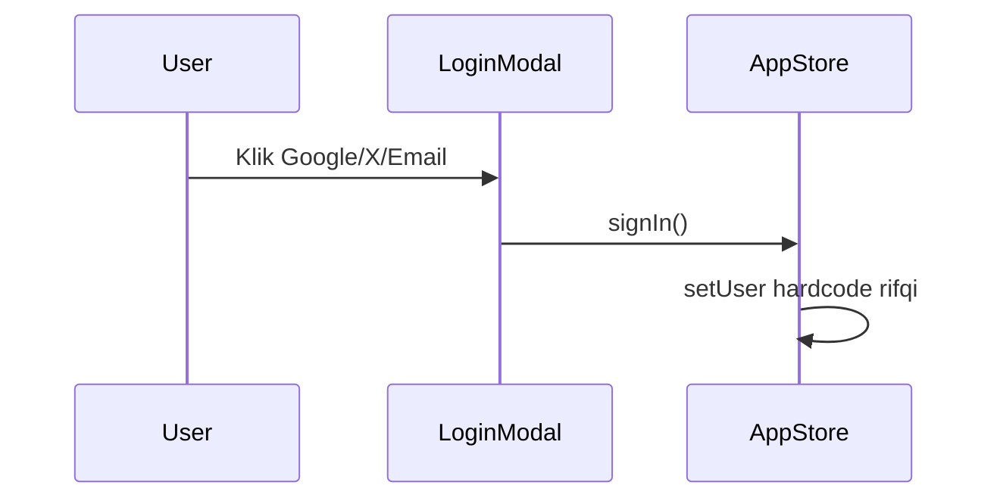
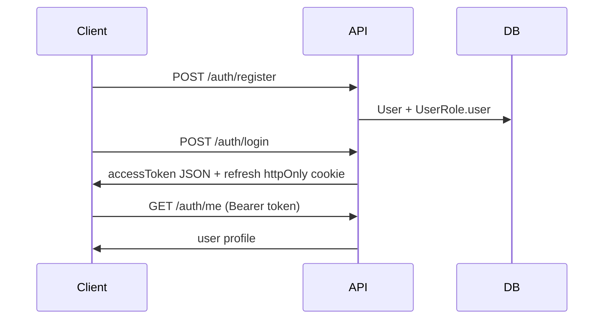
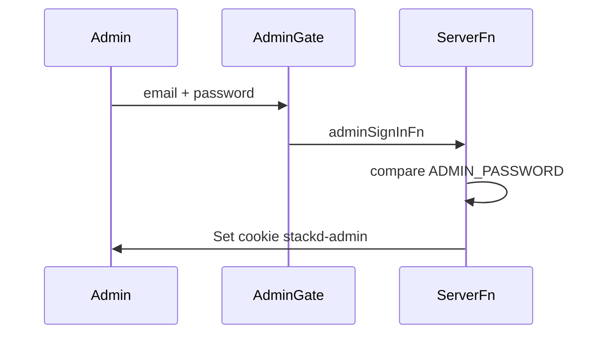
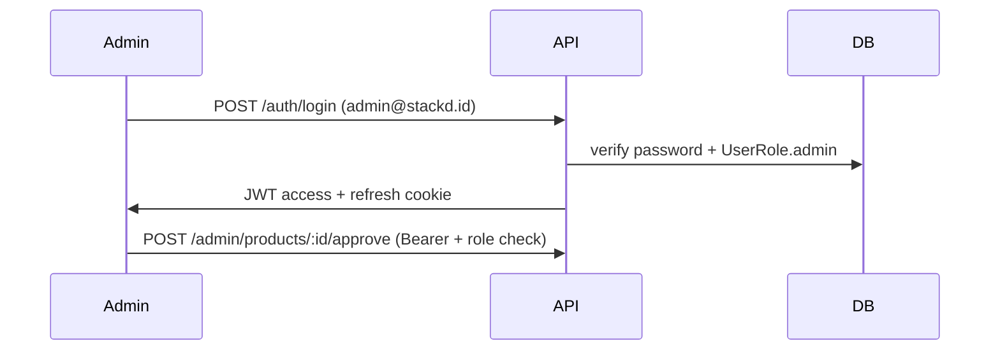
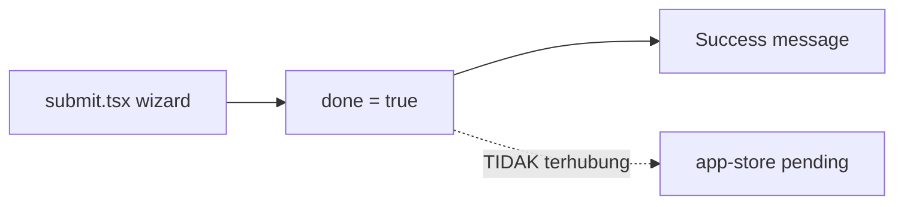
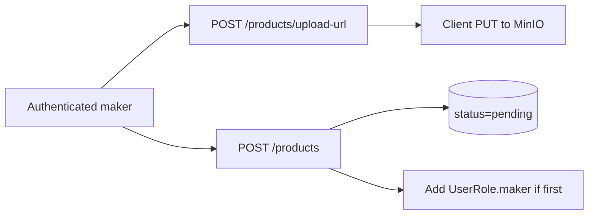
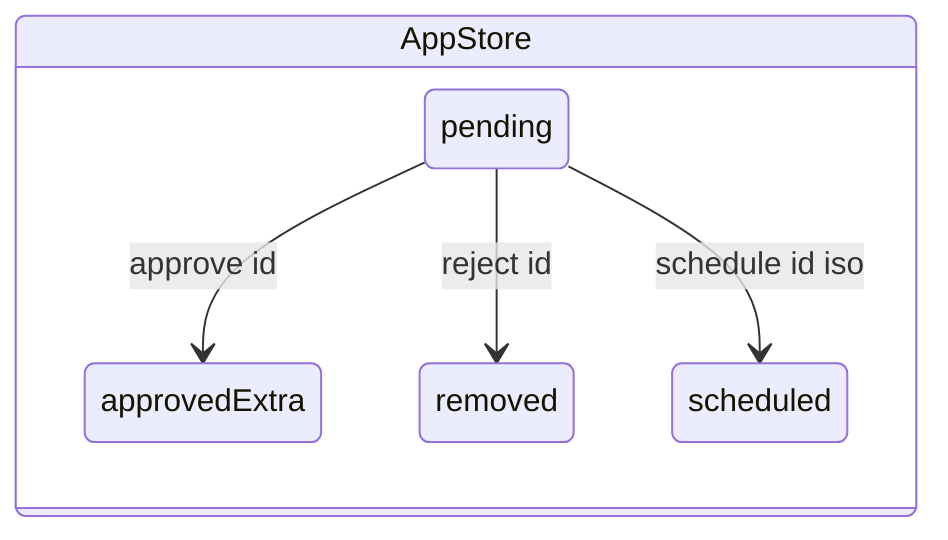
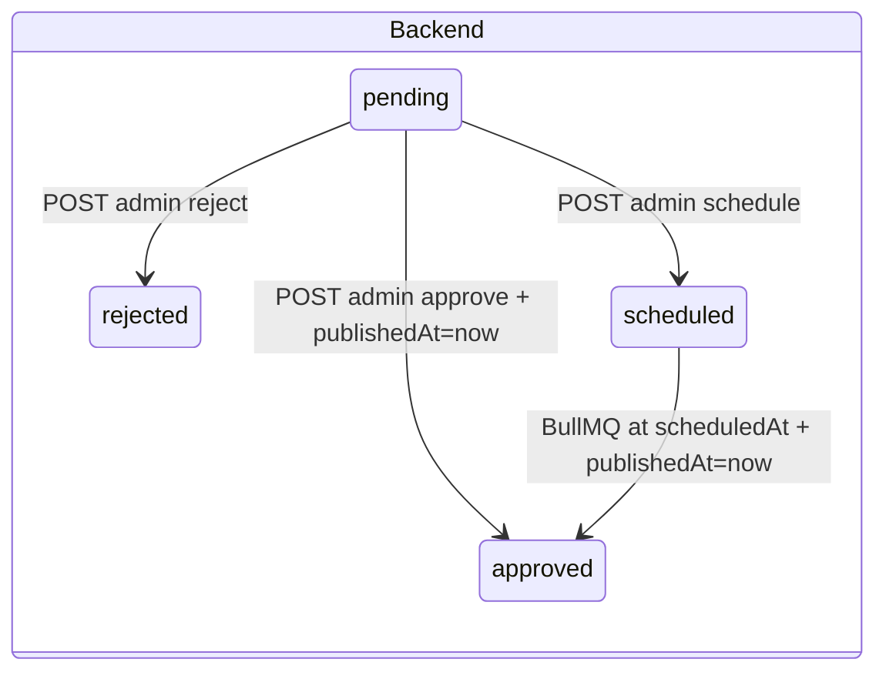

# Flow Mapping — Stackd Fullstack Next.js

> **Update (2026-07):** Repo ini sekarang **fullstack Next.js** — bukan NestJS terpisah. Mapping di bawah diadaptasi:
>
> | NestJS plan | Next.js implementation |
> |-------------|------------------------|
> | `POST /auth/login` | Auth.js Credentials + `/login` |
> | `POST /products/:id/vote` | `toggleVote()` Server Action |
> | `POST /products` submit | `submitProduct()` Server Action |
> | `POST /admin/products/:id/approve` | `approveProduct()` Server Action |
> | `GET /products` | RSC `getVisibleProducts()` di `app/page.tsx` |
> | `app-store.tsx` state | Prisma DB + `router.refresh()` |

---

# Flow Mapping — Frontend vs Backend (original reference)

Dokumen ini memetakan setiap alur di frontend (`stack-id-product`) ke backend yang menggantikannya. **Repo TanStack Start tidak lagi dipakai** — UI di-port ke Next.js di repo ini.

**Referensi lama (TanStack Start):**
- State: `src/lib/app-store.tsx`
- Types/seed: `src/lib/mock-data.ts`
- Admin auth: `src/lib/admin-auth.functions.ts`

**Implementasi sekarang:**
- Auth: `src/lib/auth.ts` + `src/lib/actions/app.ts`
- Reads: `src/lib/queries/products.ts` (Server Components)
- Writes: `src/lib/actions/app.ts` (Server Actions)

---

## 1. Auth — End User

### Frontend (sekarang)



File: `src/components/login-modal.tsx` → `signIn()` di `app-store.tsx` L80-83.

### Backend (target)



### Mapping

| Frontend | Backend | Catatan |
|----------|---------|---------|
| `signIn()` | `POST /auth/login` | OAuth buttons → fase 2 |
| `signOut()` | `POST /auth/logout` | Clear refresh cookie |
| `user` state | `GET /auth/me` | React Query cache |
| — | `POST /auth/refresh` | Silent refresh sebelum access expired |

**Boundary fase 1:** Frontend mock tetap jalan. Backend auth ditest via e2e/cURL.

---

## 2. Auth — Admin (Dual System)

### Frontend (sekarang)



File: `src/lib/admin-auth.functions.ts` — cookie `stackd-admin`, env `ADMIN_PASSWORD`.

### Backend (target)



### Mapping

| Frontend admin | Backend admin | Integrasi nanti |
|----------------|---------------|-----------------|
| `adminSignIn()` | `POST /auth/login` | Ganti AdminGate pakai backend JWT |
| `isAdmin` from cookie | `@Roles('admin')` guard | Hapus dual auth |
| `getAdminStatus()` | `GET /auth/me` + check roles | — |

**Boundary fase 1:** Dua sistem **tidak saling tahu**. Jangan sync cookie frontend ke backend.

---

## 3. Product Submit

### Frontend (sekarang)



File: `src/routes/submit.tsx` — 4 step form, `setDone(true)` lokal, tidak POST apapun.

### Backend (target)



### Mapping

| Frontend step | Backend action |
|---------------|----------------|
| Basic Info (name, tagline, category) | Body `POST /products` |
| Media (thumbnail, screenshots) | `POST /products/upload-url` → presigned PUT |
| Details (description, tags, website) | Body `POST /products` |
| Preview → Submit | `POST /products` |
| Field `video` | **Diabaikan MVP** |

**Boundary fase 1:** Submit form frontend tidak memanggil backend.

---

## 4. Admin Queue — Approve / Reject / Schedule

### Frontend (sekarang)

File: `src/routes/admin.queue.tsx` + `app-store.tsx` L141-156.



- `approve()` → `{ ...p, status: "approved" }` → `approvedExtra` → muncul di home
- `reject()` → hapus dari `pending`
- `schedule()` → `{ ...p, status: "scheduled", scheduledAt }` → array `scheduled` (no auto-publish)

### Backend (target)



### Mapping

| Frontend action | Backend endpoint | Perbedaan penting |
|-----------------|------------------|-------------------|
| `approve(id)` | `POST /admin/products/:id/approve` | Backend set `publishedAt=now()` |
| `reject(id)` | `POST /admin/products/:id/reject` | Simpan reason + AdminAudit |
| `schedule(id, iso)` | `POST /admin/products/:id/schedule` | Backend BullMQ auto-publish |
| `pending` list | `GET /admin/queue?status=pending` | — |
| `scheduled` list | `GET /admin/queue?status=scheduled` | — |

**Status mapping:** Frontend `"approved"` on leaderboard = backend `approved` + `publishedAt != null`. Frontend badge `"published"` = kondisi yang sama, bukan enum terpisah.

---

## 5. Leaderboard (Home)

### Frontend (sekarang)

File: `src/routes/index.tsx` L25-34.

```
all = [...approvedExtra, ...PRODUCTS]
filter by launchDate (Hari Ini / Kemarin / Minggu / Bulan)
sort by votes[id] ?? upvotes DESC
```

### Backend (target)

```
GET /products?tab=today|yesterday|week|month&sort=popular|newest&cursor=
Filter: status=approved AND publishedAt IS NOT NULL
Sort: vote count DESC (default)
```

### Mapping

| Frontend tab | Backend param |
|--------------|---------------|
| Hari Ini | `tab=today` |
| Kemarin | `tab=yesterday` |
| Minggu Ini | `tab=week` |
| Bulan Ini | `tab=month` |

| Frontend vote overlay | Backend field |
|-----------------------|---------------|
| `votes[id]` from app-store | `upvotes` aggregated from Vote table |
| `upvoted` Set | `hasUpvoted: true` when JWT present |

---

## 6. Upvote Toggle

### Frontend (sekarang)

`app-store.tsx` L109-117:

```
if (!user) → open login modal
toggle Set upvoted
increment/decrement votes[id]
```

### Backend (target)

```
POST /products/:id/vote (JWT required)
Toggle Vote row (insert or delete)
Return { upvotes, hasUpvoted }
Rate limit: 30/min/user
```

**Boundary:** Frontend client-only count bisa drift. Backend Vote table = source of truth.

---

## 7. Comments

### Frontend (sekarang)

- Seed: `COMMENTS` → `commentsByProduct` map
- Add: `addComment()` prepend dengan `createdAt: "just now"`
- `product.comments` count on cards bisa drift dari array length

### Backend (target)

```
GET  /products/:id/comments?cursor=
POST /products/:id/comments (JWT)
DELETE /comments/:id (author or admin)
```

Comment count on product = `COUNT(*)` from Comment where deletedAt IS NULL.

---

## 8. Follow Creators

### Frontend (sekarang)

`app-store.tsx` L120-127 — `following` Set, toggle di `creators.tsx`.

Profile page Follow button **belum wired** ke `toggleFollow`.

### Backend (target)

```
POST /users/:username/follow (JWT, toggle)
GET  /users/me/following
```

User response includes `followerCount`, `isFollowing` (when JWT present).

---

## 9. Newsletter

### Frontend (sekarang)

- Seed: `INITIAL_NEWSLETTERS` in `app-store.tsx` (n4 published, n5 draft)
- Admin CMS: `saveNewsletter`, ` -deleteNewsletter` in-memory
- Public `/newsletter`: filter `status === "published"`
- Subscribe: toast only

### Backend (target)

| Frontend | Backend |
|----------|---------|
| `newsletters` filter published | `GET /newsletters` |
| Newsletter detail | `GET /newsletters/:slug` |
| Subscribe toast | `POST /newsletters/subscribe` → email confirm |
| Admin saveNewsletter | `POST/PATCH /admin/newsletters` |
| Admin publish | `POST /admin/newsletters/:id/publish` |
| Contact admin form | `POST /admin/contact` |

---

## 10. Search

### Frontend: `src/routes/search.tsx` — filter PRODUCTS by name, tagline, tags.

### Backend: `GET /search?q=&type=product|creator` — pg_trgm on Product.name/tagline + User.username/name.

---

## 11. User Profile

### Frontend: `src/routes/u.$username.tsx`

- `getUser(username)` + `productsByMaker(username)`
- Upvoted tab: `PRODUCTS.slice(0, 4)` hardcoded stub

### Backend:

```
GET /users/:username → profile + products + followerCount
GET /users/:username/upvotes → fase 2
```

---

## 12. Categories

### Frontend: static `CATEGORIES` in mock-data.ts.

### Backend: `GET /categories` (seeded), `GET /categories/:slug/products`.

Same 9 slugs — see docs/SEED.md.

---

## 13. Integrasi — Urutan Migrasi Frontend

Saat backend e2e hijau, migrasi frontend **berurutan** (hindari half-migrated state):

```
1. api-client.ts + env VITE_API_URL
2. GET /categories, GET /products (read-only pages)
3. Auth: login/register → replace signIn mock
4. POST /products/:id/vote, comments
5. POST /products submit flow
6. Admin: replace app-store queue dengan /admin/*
7. Newsletter public + subscribe
8. Admin auth: JWT replaces stackd-admin cookie
9. Remove mock seed imports (keep types)
```

---

## 14. Anti-patterns (jangan lakukan)

| Anti-pattern | Kenapa salah |
|--------------|--------------|
| Backend baca file mock-data.ts frontend | Repo terpisah — seed copy di prisma/seed.ts |
| Frontend call backend + keep app-store mutations | Double write, state drift |
| Dua admin auth systems after integrasi | Pick one: JWT + RBAC |
| Enum `published` di Product Prisma | Use `publishedAt` instead |
| Store upvotes count on Product row | Aggregate from Vote |
| Proxy file upload through NestJS | Presigned URL only |
